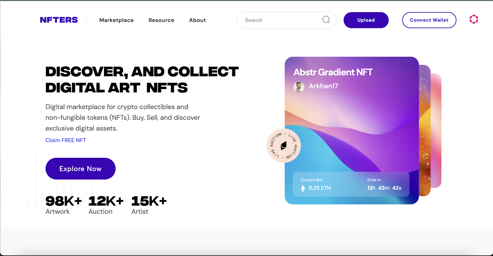

# NFTers

The goal was to create a website from a figma design with the following technologies:

- Next.js
- Node.js (with express) for backend
- a MongoDB database to store data

## How to run

1. Create and fill an `.env` file using `.env.local.example` as a template

2. Install dependencides

`yarn install`

3. Launch backend

Go to the dir of the backend and launch it

`yarn launch`

4. Launch frontend

`yarn dev`
